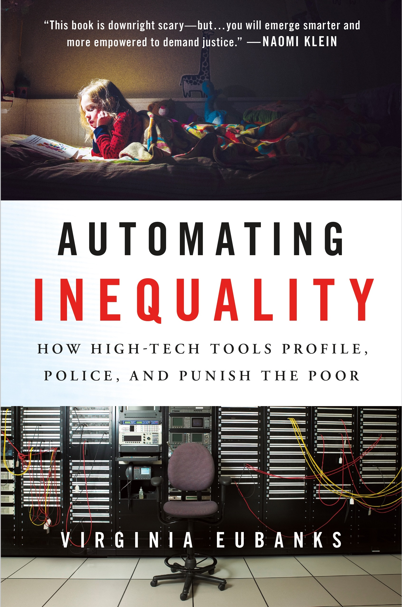
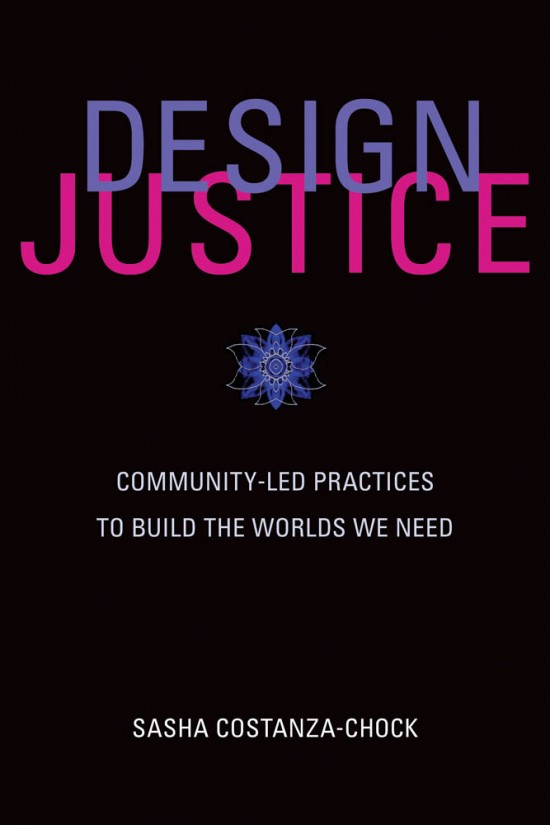
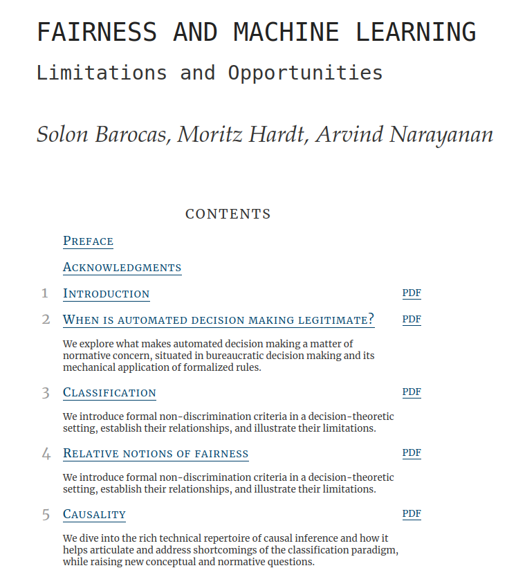
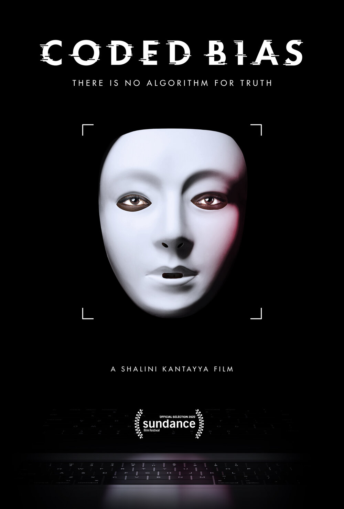
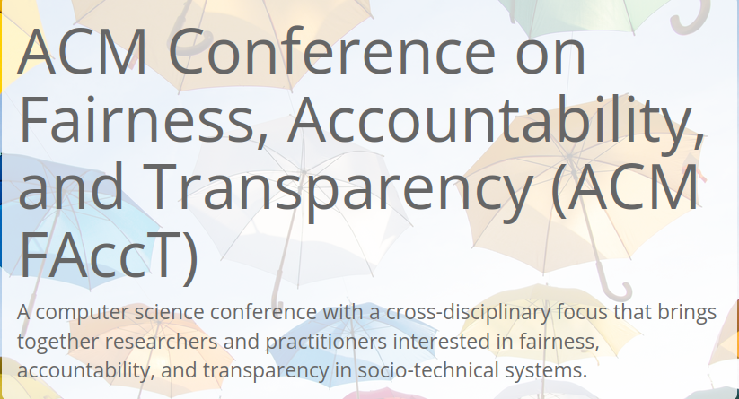
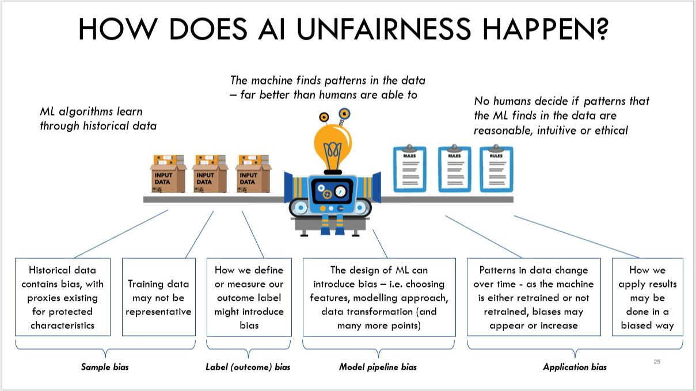

# Equidad, Rendición de Cuentas, y Transparencia en el Aprendizaje Automático para el caso la discriminación de género
### Introducción a los Modelos Computacionales. Grado en Ingeniería Informática. Universidad de Córdoba. 2022-2023

Ana Valdivia García (Oxford University)
Javier Sánchez Monedero (Universidad de Córdoba)

--- 

# Objetivos
* Introducción a FATE
* Auditando a un algoritmo
* [FairLearn](https://fairlearn.org/)

--- 

# ¿Por dónde empezar? Libros

   

--- 

# ¿Por dónde empezar? Películas

---
# FATE:

* **Fairness**: imparcialidad/ecuanimidad
* **Accountability**: rendición de cuentas
* **Transparency**: transparencia 
* **Ethics**: ética

[facctconference.org](https://facctconference.org/)
[facctconference.org/network](https://facctconference.org/network/)

---
# Objetivo del seminario

Discriminación en sistemas que toman decisiones trascendentales
* Esto excluye otras formas de discriminación o injusticia

La discriminación no es un concepto general, depende: 
* Dominio del problema
* Grupo social

---
# Fuentes de inequidad

Fuente Luke Vilain.

---
# Casos: procesamiento lenguaje natural

---
# Casos: reconocimiento facial

---
# Casos: biomedicina

---
# Taxonomía, métricas y problemas

Taxonomía simplificada fairness metrics: 
https://textbook.coleridgeinitiative.org/chap-bias.html#dealing-with-bias 