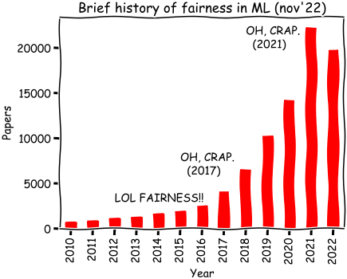

# Equidad, Rendición de Cuentas, y Transparencia en el Aprendizaje Automático para el caso la discriminación de género
### Introducción a los Modelos Computacionales. Grado en Ingeniería Informática. Universidad de Córdoba. 2022-2023

Ana Valdivia García (Oxford University)
Javier Sánchez Monedero (Universidad de Córdoba)

--- 

# Objetivos
## Parte I
- Introducción y motivación a FATE en IA
- Cuantificando y mitigando sesgos. [FairLearn](https://fairlearn.org/)
## Parte II
- Auditando a un algoritmo interdisciplinarmente.

---
<!-- _backgroundColor: "#123" -->
<!-- _color: "#fff" -->
##### <!--fit--> Introducción y motivación a FATE
--- 

# ¿Por dónde empezar? Libros

   

--- 

# ¿Por dónde empezar? En vídeo

- Documental [Coded Bias](https://www.codedbias.com/)
- TED Talk de Joy Buolamwini [How I'm fighting bias in algorithms](https://www.ted.com/talks/joy_buolamwini_how_i_m_fighting_bias_in_algorithms)

---
# FATE:

- **Fairness**: imparcialidad/ecuanimidad
- **Accountability**: rendición de cuentas
- **Transparency**: transparencia 
- **Ethics**: ética

[facctconference.org](https://facctconference.org/)
[facctconference.org/network](https://facctconference.org/network/)

---
# Objetivo del seminario

Discriminación en **sistemas/modelos** que toman decisiones trascendentales
- Esto no considera otras formas de discriminación o injusticia
- Las cuestiones de discriminación/igualdad necesitan de otro tipo de intervenciones no técnicas (ver libros recomendados)

**La discriminación no es un concepto general**, depende: 
- Dominio del problema
- Grupo social

La presentación de [Judging the algorithm](https://arxiv.org/abs/2203.03723) dará una visión más interdisciplinar de este prolema. 

---
# Grupos protegidos

Clases protegidas (no en todos los contextos): 
- EEUU: “raza”, color, sexo, religión, ciudadanía, embarazo...
- España: género, ley igualdad de trato, embarazo, ley igualdad de trato “raza”, embarazo...

<!--
Con el "pero" de lo difícil de expresar la pertenencia a grupo, es interesante [intersectionalityscore.com](https://intersectionalityscore.com/)

-->

---
# Ley integral igualdad de trato y no discriminación

[Artículo 23 Ley 15/2022, de 12 de julio](https://www.boe.es/buscar/doc.php?id=BOE-A-2022-11589): 

---
# Las personas también tienen sesgos

 

Diferencias (O'Neil 2016): 
* Sistematización
* Escala
* Nuevos grupos "digitales" discriminados

> O’Neil, C (2018). [Armas de destrucción matemática](https://capitanswing.com/libros/armas-de-destruccion-matematica/)

---
# Casos: PNL + Visión Artificial

> Zhao, J. et. al (2017). [Men Also Like Shopping: Reducing Gender Bias Amplification using Corpus-level Constraints.](https://www.aclweb.org/anthology/D17-1319) 

---
# Casos: reconocimiento facial

Análisis interseccional del rendimiento en reconocimiento facial de Amazon Rekognition. La menor tasa de acierto se da para las mujeres de piel oscura. 

> Fuente Buolamwini (2019). [Response: Racial and Gender bias in Amazon Rekognition — Commercial AI System for Analyzing Faces.](https://medium.com/@Joy.Buolamwini/response-racial-and-gender-bias-in-amazon-rekognition-commercial-ai-system-for-analyzing-faces-a289222eeced)

---
# Casos: biomedicina

> Verna, E. C., & Lai, J. C. (2020). Time for Action to Address the Persistent Sex-Based Disparity in Liver Transplant Access. JAMA Surgery, 155(7), 545–547.https://doi.org10.1001/jamasurg.2020.1126

---
<!-- _backgroundColor: "darkgreen" -->
<!-- _color: "cornsilk" -->
# ¿Cómo cuantificarías el sesgo en los problemas anteriores?

<!-- Penitenciario: "Predicción" riesgo de reincidencia: el sistema sobreestima el riesgo para afroamericanos en comparación con población blanca-->
* **Reconocimiento facial**: el modelo tiene menos precisión identificando mujeres con piel oscura
* **Medicina**: el modelo subestima el riesgo de mujeres de morir en lista de espera
* **Procesamiento lenguaje natural**: el sistema reproduce estereotipos de género asociados a profesiones

  
---
# Inventarios de casos

[Automating Society Report 2020](https://automatingsociety.algorithmwatch.org/report2020/spain)

[Observatory of Algorithms with Social Impact](https://eticasfoundation.org/oasi)

---
<!-- _backgroundColor: "#123" -->
<!-- _color: "#fff" -->
##### <!--fit--> Cuantificando y mitigando sesgos

---
# ¿Cómo medir y mitigar el sesgo?

~~Ecuanimidad sin hacer nada (*unawareness*)~~

Actualizada del [NIPS 2017 Tutorial on Fairness in Machine Learning](https://fairmlbook.org/tutorial1.html)

---
# Caso: Estimación de fallo hepático

---
# Recap: Fuentes de sesgo

> Fuente Luke Vilain.

---
# Taxonomía, métricas y problemas

Taxonomía simplificada fairness metrics: 
https://textbook.coleridgeinitiative.org/chap-bias.html#dealing-with-bias 

---
<!-- _backgroundColor: "#123" -->
<!-- _color: "#fff" -->
##### <!--fit--> Auditando a un algoritmo interdisciplinarmente

---

A. Valdivia, C. Hyde-Vaamonde, J. García-Marcos. Judging the algorithm: A case study on the risk assessment tool for gender-based violence implemented in the Basque country. https://arxiv.org/abs/2203.03723

---
# Referencias

- Solon Barocas and Moritz Hardt and Arvind Narayanan (2019). *Fairness and Machine Learning: Limitations and Opportunities*. http://www.fairmlbook.org
- Moritz Hardt (2020). *Fairness and Machine Learning* ([Part 1](https://www.youtube.com/watch?v=Igq_S_7IfOU), [Part 2](https://www.youtube.com/watch?v=9oNVFQ9llPc)) (MLSS 2020)